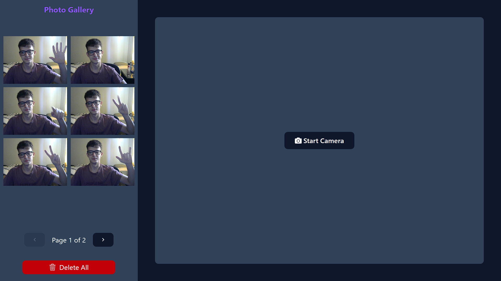

# 📸 Photo Gallery App

Welcome! 🎉 This is a photo gallery app where you can capture images using your camera and store them locally.

<p align="center">
  
</p>

## 🛠️ Technologies Used

- ⚡ [Vite](https://vitejs.dev/) + React
- 🎨 Tailwind CSS (or any other framework if used)
- 📷 getUserMedia API for camera access
- 💾 localStorage for photo persistence
- 🏗️ Reusable components with React

## 🚀 Installation & Setup

### 1️⃣ Clone the Repository

```bash
git clone https://github.com/santigalardi/frontend-challenge.git
cd frontend-challenge
```

### 2️⃣ Install Dependencies

```bash
npm install
# or
yarn install
# or
pnpm install
```

### 3️⃣ Run the Development Server

```bash
npm run dev
# or
yarn dev
# or
pnpm dev
```

The app will be available at `http://localhost:5173/` (or the port assigned by Vite).

## 📷 How to Use

1️⃣ Click **"Start Camera"** to activate the camera.  
2️⃣ Press **"Take Photo"** to capture an image.  
3️⃣ Photos will appear in the side gallery with **pagination**.  
4️⃣ Click on a photo to **view it in full size**.  
5️⃣ Use the **pagination controls** to navigate through stored images.  
6️⃣ Photos persist after page reload, stored in **localStorage**.

## 🛠 Features

✅ **Capture Photos** – Take pictures directly from your device's camera.  
✅ **Local Storage** – Photos are saved persistently using localStorage.  
✅ **Pagination** – Browse stored images efficiently with navigation controls.  
✅ **Responsive Design** – Fully functional on mobile, tablet, and desktop.  
✅ **Full-Size View** – Click on an image to expand it.  
✅ **Delete Option** – Remove unwanted images with a simple click.
